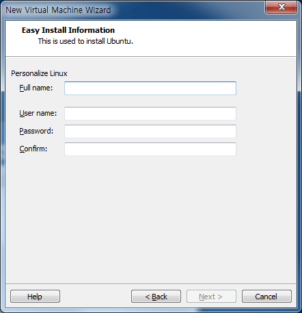
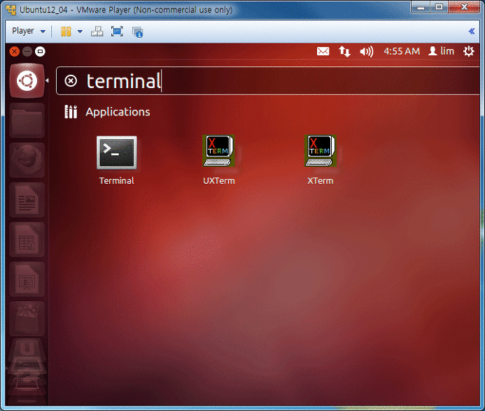
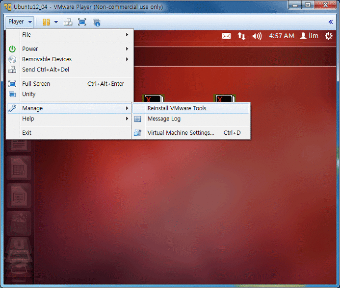

  
**1\. VMPlayer 다운로드**  
[ _https://my.vmware.com/web/vmware/free#desktop_end_user_computing/vmware_player/5_0_](https://my.vmware.com/web/vmware/free#desktop_end_user_computing/vmware_player/5_0)  
**  
**2.****우분투 다운로드****  
[ _http://www.ubuntu.com/download/desktop_](http://www.ubuntu.com/download/desktop)  
  
**3\. 우분투 설치 진행 시, 아래화면에 적는 것이 계정이름과 로그인 암호가 된다.**

**  
**  
  
**4\. root 계정 암호 설정**  
sudo passwd root  
  
**5\. X-Window 설치**  
sudo apt-get install xinit  
sudo apt-get update  
sudo apt-get upgrade  
sudo apt-get install ubuntu-desktop  
startx  
  
**6\. Terminal 창의 위치**  
****

**  
**  
**7\. VMware Tool 설치(아래 그림은 설치 후, 화면)**  
****

**  
**
