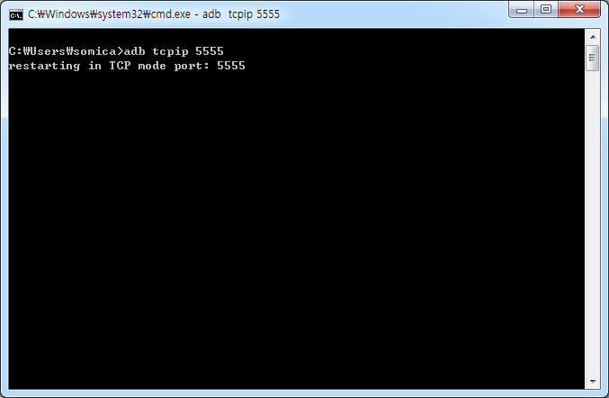
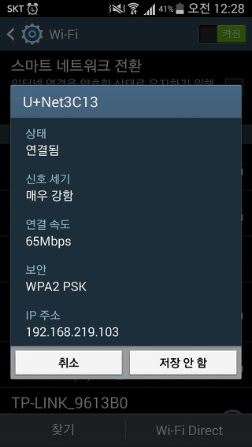
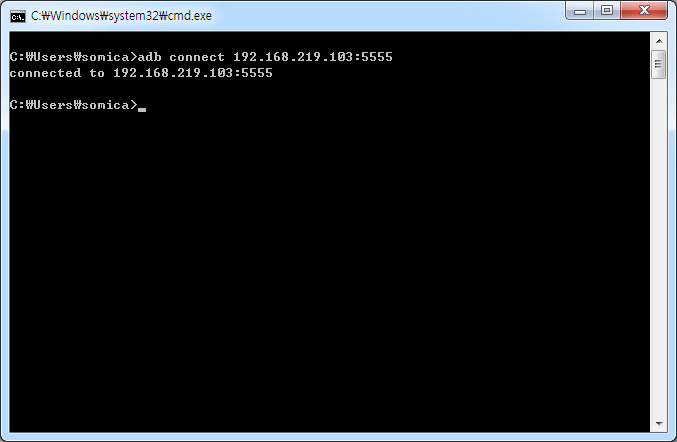
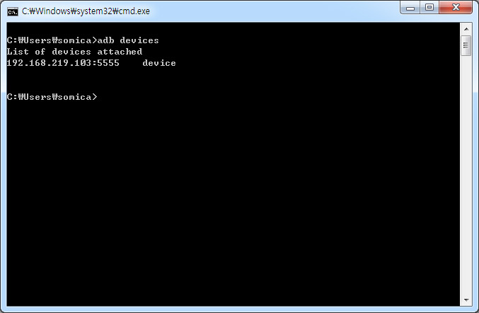

  

**1\. 전제 조건**

1) 안드로이드 폰에 유선 개발 환경이 이미 갖추어져 있어야 한다.

\- PC에 adb 설치, USB 디버깅 모드 등 (루팅할 필요는 없다.)

2) PC와 스마트폰 같은 네트워크 대역에 있어야 한다. 

\- 양쪽 모두 192.168.xxx.xxx 대역

\- 집에 AP가 없거나, 같은 네트워크 구성이 필요할 경우 

> [TIP. 노트북으로 핫스팟(AP) 구성하기](http://priv.tistory.com/73)

  

**2\. USB 케이블 연결된 상태에서**

> adb tcpip 5555 입력 

  

  

  

**3\. USB 케이블 제거 후에, 스마트폰의 IP와 위에서 지정한 포트로 접속한다.**

> adb connect 192.168.219.103:5555

(안드로이드 폰의 IP는 WiFi 네트워크 창에서 연결된 AP를 클릭해 확인할 수 있다.)

  

  

  

  

  

**4\. 연결 확인**

> adb devices

  

  

  

**5\. 이클립스나 안드로이드 스튜디오에서 빌드 하면 스마트폰에 애플리케이션이 올라오는 것을 확인할 수 있다.**

  

  

