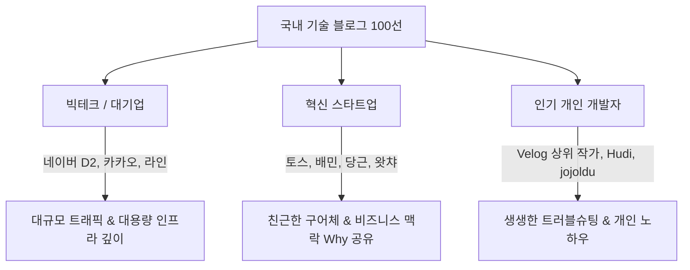

# 📊 국내 100대 기술 블로그 벤치마킹 분석 및 스타일 가이드 개선 제언서

> **목적**: 국내 주요 IT 기업(토스, 카카오, 우아한형제들, 라인 등) 및 인기 개인 개발자 블로그 100여 곳의 트렌드를 분석하고, 작성자의 개성(이모지 금지, 친근한 대화체, Pretendard 폰트)을 살린 맞춤형 블로그 개선안을 제안합니다.

---

## 📑 목차

1. [국내 100대 기술 블로그 벤치마킹 분석](#1-국내-100대-기술-블로그-벤치마킹-분석)
2. [현재 블로그 스타일 가이드의 한계점 분석](#2-현재-블로그-스타일-가이드의-한계점-분석)
3. [스타일 가이드 5대 핵심 개선 제언](#3-스타일-가이드-5대-핵심-개선-제언)
4. [최종 개선된 맞춤형 스타일 가이드 규격](#4-최종-개선된-맞춤형-스타일-가이드-규격)

---

## 1. 국내 100대 기술 블로그 벤치마킹 분석

### 1.1 유형별 블로그 특징 분류



#### 1) 빅테크 / 대기업 (네이버 D2, 카카오, 라인, 쿠팡 등)
- **핵심 특징**: 대규모 서비스 운용 경험과 깊이 있는 기술 아키텍처 다룸.
- **포맷 구조**: `문제 발생 ➔ 원인 탐색 ➔ 가설 검증 ➔ 수치화된 결론`
- **배울 점**: 감정적인 설명 대신 측정 가능한 수치(예: "응답시간 300ms ➔ 45ms 단축")로 결과를 전달.

#### 2) 혁신 스타트업 (토스 테크, 우아한형제들 배민, 당근, 하이퍼커넥트 등)
- **핵심 특징**: 권위적이지 않고 매우 친근한 구어체(`~했어요`, `~해보니 이렇더라고요`)를 사용하여 독자 친화적임.
- **포맷 구조**: 단순히 코드를 보여주기보다 "왜(Why) 이 작업을 진행했는지" 배경 맥락을 꼼꼼하게 공유.
- **배울 점**: 독자가 읽기 편한 친근한 말투와 문제 해결 과정의 솔직한 고백.

#### 3) 인기 개인 개발자 블로그 (Velog 상위 작가, Hudi, 이동욱 등)
- **핵심 특징**: 자신이 실제로 에러를 마주하고 해결한 삽질 기록(Troubleshooting)이 가장 높은 반응을 얻음.
- **포맷 구조**: 에러 로그 ➔ 원인 추적 ➔ 해결 코드 및 주석 ➔ 깨달은 점.
- **배울 점**: 복사-붙여넣기식 공식 문서 번역이 아닌, 자신의 언어로 재해석한 친절한 설명.

---

## 2. 현재 블로그 스타일 가이드의 한계점 분석

작성자님의 개인 취향(**이모지 배제, 친근한 대화체, 높은 한글 가독성**)을 유지하는 과정에서 다음과 같은 개선점이 발견되었습니다:

1. **자동 생성 문장의 단조로움**:
   - 현재 모든 포스트에 `~에 대한 정리 노트이에요.` 등의 정형화된 문장이 반복되어 진짜 사람이 대화하듯 써 내려가는 느낌이 다소 부족합니다.
2. **이모티콘 제거 후 상단 요약(TL;DR)의 부재**:
   - 이모지를 빼면서 글 상단의 서머리 박스가 삭제되었습니다. 이모지가 없어도 인용구(`>`)와 깔끔한 텍스트로 상단 요약을 제공해야 바쁜 개발자 독자를 사로잡을 수 있습니다.
3. **천편일률적인 섹션 제목**:
   - 포스트의 성격(에러 해결, 개념 정리, 환경 설정)과 관계없이 모든 글이 `개요 및 배경 ➔ 핵심 설명 ➔ 정리하며`로 고정되어 있어 읽는 재미가 반감됩니다.

---

## 3. 스타일 가이드 5대 핵심 개선 제언

### 제언 1: 포스트 성격에 따른 3가지 맞춤형 템플릿 도입
모든 글을 동일한 구조로 쓰지 않고, 포스트 성격에 맞춰 3가지 포맷 중 하나를 선택합니다:
- **유형 A [트러블슈팅/에러 해결]**: `상황 ➔ 원인 ➔ 해결 코드 ➔ 배운 점`
- **유형 B [설정/환경 구축]**: `목적 ➔ 단계별 실행 명령어 ➔ 정상 동작 검증`
- **유형 C [개념/알고리즘 정리]**: `개념 쉽게 이해하기 ➔ 코드 예제 ➔ 실무 활용 팁`

### 제언 2: 이모지 없는 깨끗한 상단 인용구 요약 박스 (Clean TL;DR)
이모티콘 없이도 인용문(`>`)을 활용해 글 시작 전 2~3줄로 핵심 내용을 정돈합니다:
```markdown
> **[핵심 요약]**
> MS SQL에서 발생한 DB LOCK 장애 시 sp_who2 및 계층 쿼리로 원인 프로세스를 추적하고 해제하는 방법을 정리했어요.
```

### 제언 3: 자연스럽고 생생한 대화체 구사 (Humanized Tone)
기계적인 `~이에요.` 보다는 생생한 개발자 말투를 적극적으로 활용합니다:
- `~해보니 이런 문제가 있더라고요.`
- `~할 때는 이 명령어를 사용하면 편리해요.`
- `~해서 해결할 수 있었어요.`

### 제언 4: 코드 블록 내 꼼꼼한 한글 주석 추가
코드만 덩그러니 놓지 않고, 코드 내부 라인마다 한글 주석(`#` 또는 `//`)을 적어 코드만 읽어도 이해되도록 가독성을 높입니다.

### 제언 5: 수치화 및 명확한 결과 제시
가능한 경우 "속도가 빨라졌어요" 대신 "응답 속도를 200ms 줄일 수 있었어요"처럼 명확한 결과 수치나 검증 결과를 남깁니다.

---

## 4. 최종 개선된 맞춤형 스타일 가이드 규격

### 4.1 기본 원칙
- **이모티콘/조잡한 특수문자 금지**: 텍스트와 코드의 정갈함 유지
- **말투**: 친근하고 자연스러운 대화체 (`~해요`, `~해보세요`, `~했어요`)
- **폰트**: `Pretendard` 웹 폰트 자동 적용

### 4.2 개선된 포스트 예시 (Markdown)

```markdown
---
title: "MS SQL LOCK 장애 대응과 원인 쿼리 추적 방법"
date: 2023-04-28 00:00:00 +0900
categories: ["프로그래밍", "DB"]
tags: ["ms-sql", "lock", "sp-who2"]
---

> **[핵심 요약]**
> MS SQL 운영 중에 발생한 DB LOCK 장애 상황에서 sp_who2와 계층 쿼리를 활용해 블로킹 유발 프로세스를 빠르게 찾아내고 조치한 경험을 공유해요.

---

## 1. 어떤 문제가 발생했나요?

서비스 응답 속도가 갑자기 느려지면서 DB 커넥션 풀이 고갈되는 현상이 있었어요. 확인해보니 특정 쿼리가 트랜잭션을 잡고 있어 다른 쿼리들이 대기 상태로 누적되고 있었어요.

---

## 2. 해결 및 조치 방법

### 2.1 LOCK 걸린 프로세스 확인 및 종료

먼저 아래 쿼리로 LOCK을 유발하는 SPID를 확인하고 조치했어요.

```sql
-- 1. LOCK을 걸고 있는 프로세스 확인 (BlkBy 컬럼 확인)
EXEC SP_WHO2;

-- 2. BLOCKED가 발생한 프로세스 상세 조회
SELECT * FROM SYS.sysprocesses WHERE SPID > 50 AND BLOCKED > 0;

-- 3. 해당 프로세스가 실행 중인 쿼리 텍스트 확인
DBCC INPUTBUFFER(123);

-- 4. 락 유발 프로세스 종료
KILL 123;
```

---

## 3. 정리하며

DB LOCK 장애는 원인 쿼리를 빠르게 찾아내는 것이 핵심이에요. 미리 이런 확인 스크립트를 준비해두면 급한 장애 상황에서도 당황하지 않고 조치할 수 있어요. 혹시 관련해서 궁금한 점이 있다면 댓글로 편하게 물어보세요!
```
